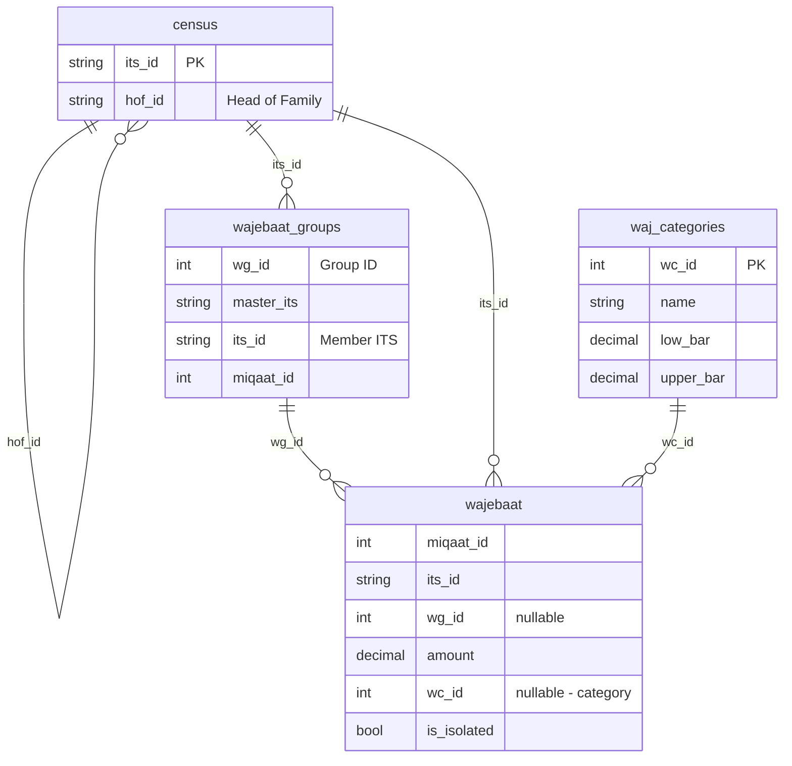

# Mumin Dashboard Expansion Plan

## Schema Summary (from Colombo Jamaat API (1).sql)




**Key relationships:**

- **census**: `hof_id` links to Head of Family; family = all census where `hof_id` = same value
- **wajebaat_groups**: Each row = one member in a group; `wg_id` groups members; `master_its` = group master; UNIQUE(miqaat_id, its_id) — one group per person per miqaat
- **wajebaat**: One record per (miqaat_id, its_id); `wg_id` links to group; `is_isolated` = 1 means member is isolated (cannot be grouped)
- **waj_categories**: Amount bands (low_bar, upper_bar) for wajebaat categorization

---

## Resolution Logic (Level 1 vs Level 2)

```mermaid
flowchart TD
    Start[User ITS + Miqaat] --> CheckGroup{In wajebaat_groups?}
    CheckGroup -->|Yes| Level1[Level 1: Group Profile]
    CheckGroup -->|No| Level2[Level 2: Family Profile]
    
    Level1 --> GetGroup[Get wg_id, master_its]
    GetGroup --> GetMembers[Get all its_id in group]
    GetMembers --> FetchData1[Fetch census + wajebaat per member]
    
    Level2 --> GetCensus[Get census for user]
    GetCensus --> GetHof[hof_id = user's HOF]
    GetHof --> GetFamily[GET /census/family/{hof_its}]
    GetFamily --> FetchData2[Fetch wajebaat for family members with records]
    
    FetchData1 --> Display[Display group/family profile]
    FetchData2 --> Display
```


---

## Current State vs Required State


| Aspect              | Current                                | Required                             |
| ------------------- | -------------------------------------- | ------------------------------------ |
| Profile scope       | Single person (user ITS only)          | Group (Level 1) or Family (Level 2)  |
| Wajebaat            | Single record via `getWajebaatByItsId` | All records for group/family members |
| is_isolated         | Not shown                              | Highlight in UI                      |
| wajebaat_categories | Not shown                              | Show category per record             |
| Family info         | Person card only                       | Family/group members list            |


---

## Part 1: Backend API Prompt

Use the following prompt with your backend (Laravel) codebase to implement the required APIs:

---

### Backend API Prompt: Mumin Dashboard Profile API

**Context:** The Mumin Dashboard at `/mumin` shows a logged-in mumin their wajebaat eligibility and payment status. Currently it fetches data for a single ITS. We need to support multi-level grouping:

1. **Level 1 (Group):** If the user's ITS is in `wajebaat_groups` for the miqaat, show the **group profile** — all members in that group (master_its + member its_ids) with their census and wajebaat.
2. **Level 2 (Family):** If the user is NOT in a wajebaat group, show the **family profile** — all census members where `hof_id` = user's `hof_id` (from census), and wajebaat records for any family member who has one.

**Database schema (relevant):**

- `census`: its_id, hof_id (Head of Family)
- `wajebaat_groups`: wg_id, miqaat_id, master_its, its_id (one row per member; UNIQUE miqaat_id+its_id)
- `wajebaat`: miqaat_id, its_id, wg_id, amount, wc_id, **is_isolated** (tinyint, default 0)
- `waj_categories`: wc_id, name, low_bar, upper_bar, hex_color

**Required endpoint:**

#### `GET /api/miqaats/{miqaat_id}/mumin-profile/{its_id}`

**Purpose:** Resolve and return the full profile for the Mumin Dashboard in one call.

**Logic:**

1. Check `wajebaat_groups` WHERE `miqaat_id` = X AND `its_id` = Y. If found:
  - Get `wg_id`, `master_its`
  - Get all members: SELECT DISTINCT its_id FROM wajebaat_groups WHERE miqaat_id = X AND wg_id = (resolved wg_id)
  - Set `profile_type: "group"`, `master_its`, `wg_id`, `group_name` (from first row if present)
2. Else (not in group):
  - Get census for its_id → `hof_id`
  - Get family: GET /census/family/{hof_id} (or equivalent query)
  - Set `profile_type: "family"`, `hof_its: hof_id`
3. For the resolved list of ITSs (from group or family):
  - Fetch census record for each
  - Fetch wajebaat for each WHERE miqaat_id = X AND its_id IN (...)
  - Include `is_isolated` and `wajebaat_category` (join waj_categories on wc_id) in each wajebaat

**Response format:**

```json
{
  "success": true,
  "data": {
    "profile_type": "group" | "family",
    "master_its": "123456",
    "hof_its": "123456",
    "wg_id": 5,
    "group_name": "AKBAR BROTHERS",
    "members": [
      {
        "its_id": "123456",
        "person": { /* CensusRecord */ },
        "wajebaat": {
          "id": 1,
          "amount": "10000.00",
          "currency": "LKR",
          "status": false,
          "is_isolated": false,
          "category": { "wc_id": 1, "name": "Tier 1", "hex_color": "#000" }
        } | null
      }
    ],
    "clearance_status": {
      "can_mark_paid": false,
      "pending_departments": [{ "mcd_id": 1, "name": "Najwa Ada" }]
    }
  }
}
```

**Notes:**

- `clearance_status` should be computed for the **primary** its_id (the logged-in user). If profile_type is group, clearance may apply to the master or the user — clarify with business rules.
- Ensure `GET /miqaats/{miqaat_id}/wajebaat/{its_id}` returns `is_isolated` in the wajebaat object for existing callers.
- Add this route to Swagger under tag "Wajebaat" or "Mumin".

---

#### Optional: `GET /api/miqaats/{miqaat_id}/wajebaat/by-its-list`

**Purpose:** Fetch wajebaat records for multiple ITSs in one call (if you prefer the frontend to call this separately).

**Query params:** `its_ids=123,456,789` (comma-separated)

**Response:** Array of wajebaat objects with `is_isolated` and `category` populated.

---

## Part 2: Frontend Changes

### 2.1 New API function ([src/services/api.ts](src/services/api.ts))

```typescript
export async function getMuminProfile(miqaatId: number, itsId: string): Promise<MuminProfile>
```

Call `GET /miqaats/{miqaat_id}/mumin-profile/{its_id}`.

### 2.2 New types ([src/types/api.ts](src/types/api.ts))

```typescript
export interface MuminProfileMember {
  its_id: string;
  person: CensusRecord | null;
  wajebaat: (Wajebaat & { category?: WajebaatCategory }) | null;
}

export interface MuminProfile {
  profile_type: 'group' | 'family';
  master_its?: string;
  hof_its?: string;
  wg_id?: number;
  group_name?: string | null;
  members: MuminProfileMember[];
  clearance_status: ClearanceStatus;
}
```

Ensure `Wajebaat` includes `is_isolated?: boolean`.

### 2.3 MuminView changes ([src/components/MuminView.tsx](src/components/MuminView.tsx))

1. **Replace** `getCensusByItsId`, `getWajebaatByItsId`, `getClearanceStatus` with a single `getMuminProfile(miqaatId, itsId)` call (or use it as primary, fallback to existing if backend not ready).
2. **Person/Family section:**
  - Show "Group Profile" or "Family Profile" based on `profile_type`
  - If group: show `group_name`, `master_its`, list of members
  - If family: show HOF, list of family members
  - For each member: name, ITS, wajebaat amount/status, **highlight if `is_isolated**` (e.g. badge "Isolated" or distinct styling)
3. **Wajebaat section:**
  - Table/cards for each member with wajebaat: ITS, Name, Amount, Category, Status, Isolated badge
  - Sort/filter as needed
4. **Clearance status:** Use `clearance_status` from profile (same as current).
5. **Sharafs and Miqaat checks:** Keep existing logic (user ITS only for now).

---

## Implementation Order

1. **Backend first:** Implement `GET /miqaats/{miqaat_id}/mumin-profile/{its_id}` and ensure `is_isolated` is returned in wajebaat responses.
2. **Frontend:** Add `getMuminProfile`, types, and update MuminView to use the new profile and display group/family with is_isolated highlighting.

---

## Files to Modify


| File                                                         | Changes                                                                    |
| ------------------------------------------------------------ | -------------------------------------------------------------------------- |
| [src/services/api.ts](src/services/api.ts)                   | Add `getMuminProfile`                                                      |
| [src/types/api.ts](src/types/api.ts)                         | Add `MuminProfile`, `MuminProfileMember`; ensure `is_isolated` in Wajebaat |
| [src/components/MuminView.tsx](src/components/MuminView.tsx) | Use `getMuminProfile`, render group/family, highlight is_isolated          |


---

## Backend Prompt (Copy-Paste Ready)

Save the "Backend API Prompt: Mumin Dashboard Profile API" section above to a file (e.g. `documents/MUMIN_DASHBOARD_BACKEND_PROMPT.md`) and use it when working on the Laravel backend. The prompt is self-contained with schema, logic, and response format.